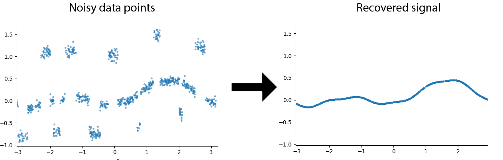
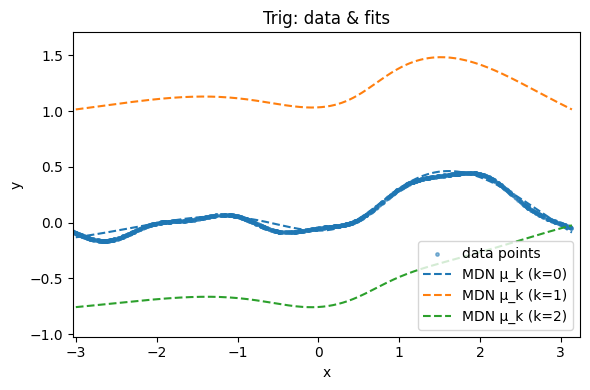

# XAI605-Midterm-Exam
This repository was created as part of the Deep Learning (XAI605) course at Korea University in 2025, serving as the midterm exam project. The assignment focuses on Robust Learning.

# Robust Learning Problem

You are given a dataset where the original signal has been corrupted by an additional noise signal.
The goal is to recover (predict) the original signal function from this noisy data, as shown in the figure.

In more rigorous term, robust learning can be undestood in terms of three stages.

### **1. Original Clean Signal**

Let the original (noise-free) function $f$ be:

$$
f: \mathcal{X} \to \mathcal{Y}, \quad y_i^{\ast} = f(x_i^{\ast})
$$

From this function, a clean dataset is generated as:

$$
D^{\ast} = \{(x_i^{\ast}, y_i^{\ast})\}_{i=1}^{N}
$$

---

### **2. Noisy Observation Model**

The observed data are corrupted by additive noise $\varepsilon_i$, resulting in the noisy dataset $D = \{(x_i, y_i)\}_{i=1}^N$:

$$
y_i = f(x_i) + \varepsilon_i, \quad \varepsilon_i \sim p(\varepsilon)
$$

---

### **3. Robust Learning Objective**

The goal of robust learning is to recover the clean function $f$ by minimizing the expected loss with respect to the noise distribution $p(\varepsilon)$:

$$
\hat{f}_\theta = \arg\min_{\theta} \mathbb{E}_{(x, y) \sim D} \mathbb{E}_{\varepsilon \sim p(\varepsilon)} 
\left[ \| f_\theta(x) - (y - \varepsilon) \|^2 \right]
$$

This formulation seeks a function that performs well on average under noise perturbations, thereby achieving robustness to noisy observations.

# Problem Description

In this task, you are given two datasets designed to evaluate your **robust learning pipeline**.
Each datasets has different original signal, injected with similar but different noises.

> **Goal:**  
Your goal is to perform **robust learning** on the given noisy data and develop a model that can **best approximate the underlying clean signal**.

> ⚠️ **Important:**  
You will be ***graded according to Dataset 2 only, Dataset 1 is for your practice***.

---

### **Dataset 1: Noisy Train Data + Clean Test Data (Example Set)**

This dataset is provided **for self-evaluation only**.  
It contains both **noisy training data** and **clean test data**, allowing you to test how well your model can recover the original clean signal.

- **Purpose:** To validate your pipeline implementation.  
- **Usage:** Train your model on the noisy data and compare its predictions against the clean test set to measure performance.  
- **Note:** This dataset is only for demonstration and internal verification — it will not be used for grading.

📂 **Data paths:**  
- [Noisy data](data1/noisy_data.npz)  
- [Clean data](data1/clean_data.npz)

---

### **Dataset 2: Noisy Train Data Only (Exam Set)**

This is the **main dataset for the exam**. 
It contains **only noisy training data**, without any clean reference.

- **Purpose:** To test whether your robust learning method can generalize and denoise effectively.
- **Usage:** Train your model using the given noisy data and submit your predictions for the hidden clean test samples.
- **Evaluation:** Your submission will be evaluated based on how accurately it predicts the unseen clean signal.

📂 **Data paths:**  
- [Noisy data](data2/noisy_data.npz)  

---

In summary:
- **Dataset 1** → for practice and debugging (has clean test data)
- **Dataset 2** → for actual grading (no clean test data provided)

You can also try plotting using [plot.py](plot.py)

# Submission Instructions

Refer to jit_example.py for an example of how to JIT-compile your trained model.

Submit your model file named with your student ID, e.g.: 2025000000.pth

Your model will be evaluated using eval.py.

> ⚠️ **Important:**  
> ***Make sure that your submission works correctly with the eval.py before submitting!***

# Hint
> ⚠️ **Important:**  
> ***This is just one suggestion for this problem. You are allowed to use other techniques.***

One possible approach for Robust Learning is to use an MDN (Mixture Density Network).
By letting each local expert (mixture component) model different modes of the signal, the network can separate the main signal from the noise signal.

For example, in **Dataset 1**, the MDN can model multiple local signal patterns (modes) present in the noisy data.  

That is to use the mode (k=0) as shown in the figure below.

Among these, the mode with the **highest occurrence probability** across the dataset typically corresponds to the **underlying clean signal**.
By isolating and using this dominant mode, you can effectively reconstruct the original signal while suppressing the influence of noise.

### **Rigorously: Mixture Density Network Formulation**

An **MDN** models the conditional probability of a target variable $y$ given an input $x$ as a mixture of $K$ Gaussian components:

$$
p(y \mid x) = \sum_{k=1}^{K} \pi_k(x) \, \mathcal{N}\big(y \mid \mu_k(x), \sigma_k^2(x)\big)
$$

-$\pi_k(x)$: mixture weight (prior probability of the $k$-th component), satisfying $\sum_{k=1}^K \pi_k(x)=1$ and $\pi_k(x)\ge0$  
-$\mu_k(x)$: mean (predicted value) of the $k$-th component  
-$\sigma_k(x)$: standard deviation of the $k$-th component

The network learns these parameters $\{\pi_k(x), \mu_k(x), \sigma_k(x)\}$ by minimizing the **negative log-likelihood (NLL)** of the observed data:

$$
\mathcal{L}_{\text{MDN}} = -\frac{1}{N} \sum_{i=1}^{N} 
\log \left[ \sum_{k=1}^{K} \pi_k(x_i) \, 
\mathcal{N}\big(y_i \mid \mu_k(x_i), \sigma_k^2(x_i)\big) \right]
$$

This formulation enables the model to represent **multi-modal distributions**,  
capturing both the **dominant clean signal** and the **noisy variations** within the data.

After training, one can extract the **most probable mode** (e.g., the component with the largest $\pi_k(x)$ to approximate the underlying clean function):

$$
\hat{f}(x) = \mu_{k^{\ast}}(x), \quad 
\text{where} \quad k^{\ast} = \arg\max_{k} \pi_k(x)
$$

This provides a possible way to recover the clean signal while being robust to noise.

### Example code

You can try running an MDN using the repository announced on Blackboard:  
https://github.com/sjchoi86/yet-another-pytorch-tutorial-v2

